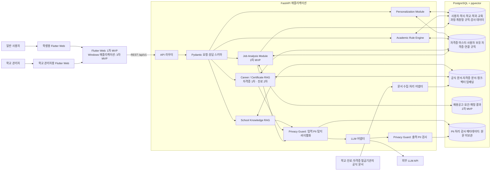
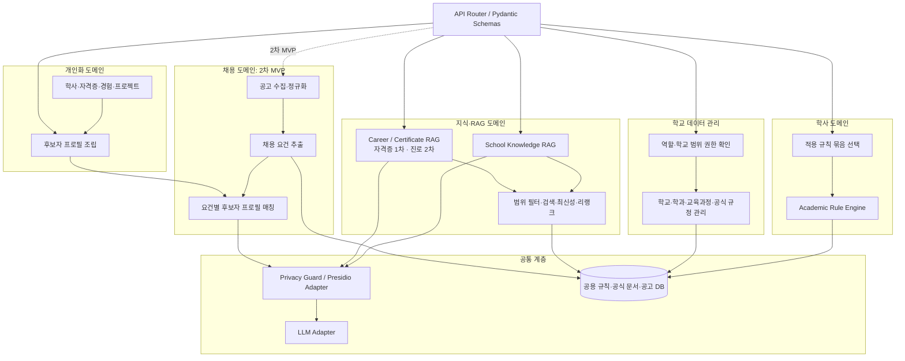
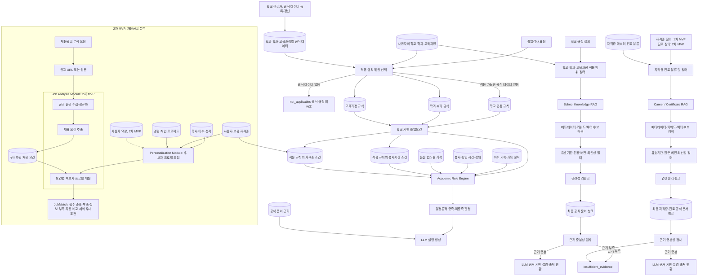
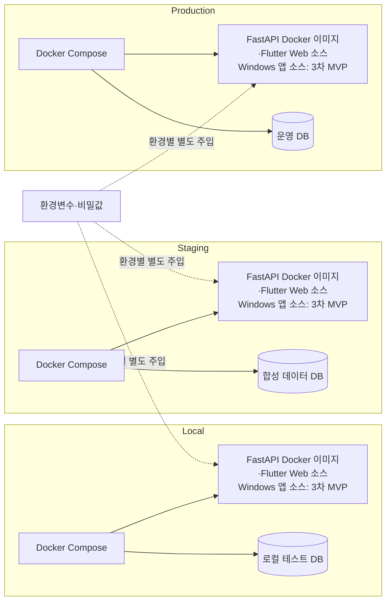

# 시스템 아키텍처 관계도

UniversityPath AI는 1차 MVP의 Flutter Web과 3차 MVP 확장인 Windows
애플리케이션, 하나의 FastAPI 애플리케이션으로 구성한다.
FastAPI 내부는 기능별 모듈로 분리하되, MVP 단계에서는 마이크로서비스로 분리하지
않는다.

### 독립 AI 대화창 목업

- Windows에서는 우측 AI 패널을 별도 Flutter OS 창으로 분리할 수 있고, Web에서는
  같은 이름의 브라우저 팝업 창을 재사용한다.
- 독립 창은 현재 목업에서 화면 문맥만 전달받는다. 실제 대화 이력과 RAG 응답 동기화는
  메모리 공유가 아니라 conversation_id를 포함한 동일 API 계약으로 처리한다.
- 메인 창의 채팅 아이콘은 기존 독립 창이 있으면 새 창을 만들지 않고 해당 창을
  전면화한다. Windows 목업에서 메인 창을 닫으면 분리 AI 창을 먼저 명시적으로
  종료한 뒤 전체 앱을 종료한다.
- Windows 분리 창은 `frontend/third_party/desktop_multi_window`의 로컬 패치본을
  사용한다. 닫힌 보조 창의 Flutter 엔진은 다음 창 생성까지 보류하지 않고, 메인
  이벤트 루프에서 즉시 해제해 앱 종료 지연을 방지한다.

## 전체 기술 관계도

## 모듈 분류도

| 모듈 | 책임 | 개인 데이터 처리 |
|---|---|---|
| Academic Rule Engine | 학교·학과·교육과정 규칙의 결정론적 졸업 판정 | 이수·자격증·봉사 승인시간 등 필요한 값만 입력으로 사용 |
| School Knowledge RAG | 학교 규정의 근거 검색·출처 제공 | 학교·학과·교육과정 범위만 사용 |
| Career / Certificate RAG (자격증 1차, 진로 2차) | 자격증·진로 공식 정보 검색·출처 제공 | 자격증·진로 분류만 사용 |
| Personalization Module | 학사·자격증·경험·프로젝트를 후보자 프로필로 조립 | 사용자 로컬 원본 데이터의 처리 경계 |
| Job Analysis Module (2차 MVP) | 공고 요건 추출과 후보자 프로필 매칭 | 공고 요건과 최소화된 후보자 프로필 비교 |
| Privacy Guard / LLM Adapter | LLM 전송 전후 PII 보호와 공급자 분리 | 원문을 최소화·비식별화해 외부 전송 |

학교 데이터가 없는 일반 사용자는 공용 모듈과 개인 직접 입력을 계속 사용할 수 있다.
이 경우 `Academic Rule Engine`과 `School Knowledge RAG`는 공식 학교·학과·교육과정
범위가 확인되지 않았으므로 **공식** 졸업 판정이나 학교 규정 답변을 추정하지 않는다.
제품이 개인 학교·학과 기준 기능을 도입하면, 학생이 구성한 개인 규칙과 직접 입력 기록은
별도 개인 기준 계산에만 사용한다. 이 계산은 `개인 기준 계산 · 학교 공식 판정 아님`으로
표시하며, 공식 규칙 묶음·다른 사용자·학교 RAG 근거를 변경하지 않는다. 학교 관리자가
공식 데이터를 등록하고 적용 범위가 사용자 프로필과 일치하면 이후 요청부터 공식 데이터가
개인 규칙보다 우선한다. 개인 이수·활동·자격증 데이터는 대체하거나 삭제하지 않는다.

## 핵심 책임과 요청 흐름

- 졸업요건의 충족·미충족 판정은 반드시 `Academic Rule Engine`이 수행한다.
  LLM은 판정 결과를 변경하지 않고, 판정과 공식 문서 근거를 자연어로 설명한다.
- 졸업감사 시작 시 사용자의 학교·학과·적용 교육과정을 기준으로 학교 공통,
  학과 추가, 교육과정별 규칙 묶음을 모두 선택한다. Rule Engine은 과목 이수·최소
  성적·자격증·봉사 승인시간·논문 등 각 규칙을 개별 판정하고, 통합 감사 결과와 규칙별 결과를
  함께 저장한다.
- 적용 가능한 공식 규칙 묶음이 없으면 Rule Engine은 졸업 가능 여부를 추정하지 않고
  `not_applicable`을 반환한다. 사용자가 입력한 개인 임시 요건은 개인 참고 분석에만
  사용할 수 있으며, 공식 감사 결과나 공식 규정으로 표시하지 않는다.
- RAG는 문서 청크와 출처 메타데이터를 검색한다. 근거가 부족하면 추측하는 대신
  `insufficient_evidence` 상태를 반환한다.
- AI 응답은 가능한 경우 문서 제목, URL, 페이지, 문서 식별자를 함께 반환한다.

### RAG별 책임

- `School Knowledge RAG`는 질의자의 학교·학과·적용 교육과정을 필터로 사용해
  해당 범위의 공식 학사 문서와 청크만 검색한다. 졸업 가능 여부 자체를 판정하지
  않으며, 규정의 근거와 설명을 제공한다.
- `Career / Certificate RAG`의 자격증 안내·응시 요건·발급 기준 검색은 1차 MVP에
  포함한다. 진로 분류와 진로 정보 검색은 2차 MVP에 포함한다. 두 기능 모두 사용자
  보유 자격증의 유효 여부나 졸업요건 충족 여부는 판정하지 않는다.
- 두 RAG 모두 검색된 문서 청크의 제목, URL, 페이지, 문서 식별자를 출처로
  반환한다. 필터 이후 충분한 근거가 없으면 LLM 호출로 내용을 보완하지 않고
  `insufficient_evidence`를 반환한다.

### 최신성 및 리랭크

- 최초 검색은 학교·학과·교육과정 또는 자격증·진로 범위의 메타데이터 필터를 먼저
  적용하고, 키워드 검색과 pgvector 유사도 검색으로 후보 문서 청크를 만든다.
- 최신성 단계는 발행일만으로 순서를 정하지 않는다. 문서의 적용 기간, 원문 갱신일,
  수집 확인일, 버전과 공식 출처 여부를 확인해 만료·대체된 문서를 제외하거나 낮은
  우선순위로 둔다.
- 리랭커는 최신성 필터를 통과한 후보 청크를 질문과의 관련성 기준으로 재정렬한다.
  리랭킹은 답변이나 졸업요건 판정을 수행하지 않으며, 최종 근거 선정만 돕는다.
- RAG 캐시 키에는 질의·적용 범위뿐 아니라 문서 버전 또는 코퍼스 버전을 포함한다.
  문서가 갱신되면 이전 검색·답변 캐시는 재사용하지 않는다.

### 채용 매칭 책임 (2차 MVP)

- `Job Analysis Module`은 공고 URL 또는 원문에서 채용 요건을 구조화한다. 공고의
  자격증·역량·학력·경력·우대 조건은 `JobRequirement` 및 관련 연결 데이터로
  보존한다.
- `Personalization Module`은 학사 이수·성적, 보유 자격증, 경험·개인 프로젝트,
  이후 도입되는 사용자 역량을 합쳐 요청 시점의 후보자 프로필을 만든다.
- 매칭기는 구조화된 공고 요건과 후보자 프로필을 항목별로 비교해 `JobMatch`와
  `JobMatchDetail`을 생성한다. 필수 요건은 충족·부족·정보 부족으로, 우대 요건은
  점수·부족 항목·자동 비교 제외 항목으로 분리한다. 자동 비교하지 못했거나 하지
  않도록 정한 모든 우대조건은 이유와 출처를 포함해 하나의 추가 안내 목록으로
  반환한다. 따라서 결과는 채용 합격 예측이 아니라 설명 가능한 공고 요건 적합도이며,
  LLM이 단독으로 결정하지 않는다.
- 후보자 프로필·매칭 결과의 재사용은 원본 개인정보의 영구 보관을 뜻하지 않는다.
  공고 분석처럼 공용으로 재사용할 수 있는 데이터는 저장하되, 개인화된 매칭 결과는
  최소한의 판정 근거만 저장하고 사용자 삭제·보유기간 만료 시 관련 캐시와 함께 파기한다.

## 자격증 정보 처리 경계

- `Certificate`, `UserCertificate` 및 학사·채용 연결 규칙은 PostgreSQL의 구조화된
  데이터로 관리한다. 사용자의 자격증 등록과 유효기간·등급·상태 확인은
  `Personalization Module`이 담당한다.
- `Career / Certificate RAG`는 자격증 시험 안내, 응시 자격, 발급 기준 등 공식
  문서를 검색하고 출처를 제공한다. RAG 결과가 사용자의 자격증 보유 여부를
  확정하지는 않는다.
- `Academic Rule Engine`은 먼저 학교·학과·교육과정의 적용 졸업 규칙을 선택한다.
  그중 자격증 조건이 있는 규칙만 `GraduationRuleCertificate`를 통해
  `UserCertificate`와 비교하고, 자격증 상태·등급·유효기간을 반영해 해당 규칙의
  충족 여부를 판정한다. 2차 MVP의 `Job Analysis Module`은 같은 데이터를
  채용공고의 자격증 요건과 비교해 매칭 근거를 생성한다.

## 운영 환경 경계

- Local, Staging, Production은 FastAPI Docker 이미지와 Flutter Web 소스 코드를
  공유하지만, 데이터베이스와 비밀값은 서로 분리한다. Windows 애플리케이션은 3차
  MVP에서 같은 API 계약을 사용하는 별도 클라이언트로 추가한다. Staging과
  Production은 같은 DB를 사용하지 않는다.
- API 키, 비밀번호, 토큰 및 실제 `.env` 파일은 저장소에 포함하지 않는다.
- 외부 LLM과 문서 수집원 의존성은 어댑터 또는 설정 계층 뒤에 두어 핵심 도메인
  로직이 특정 공급자에 직접 결합하지 않게 한다.

## 개인정보 보호 어댑터

- `Privacy Guard`는 외부 LLM으로 전달되는 자유 텍스트, 개인화 RAG 캐시, 로그의
  입력·출력 경계에 둔다. 탐지 결과에 따라 마스킹·대체·차단을 수행하고, 원문 대신
  최소한의 비식별화 텍스트만 다음 단계에 전달한다.
- Presidio는 이 어댑터의 후보 구현체다. Analyzer는 인식기 기반 PII 탐지를 지원하고,
  Anonymizer는 탐지된 값의 마스킹·대체·암호화 처리를 지원한다. 한국어·학교별
  식별자 정확도는 별도 커스텀 인식기와 테스트로 검증한 뒤 사용한다.
- 감사 로그는 정책 버전, 처리 동작, 탐지 유형 수 등 최소 메타데이터만 저장한다.
  이름, 학번, 자격증 번호, 원문 질의·응답은 감사 로그에 저장하지 않는다.
