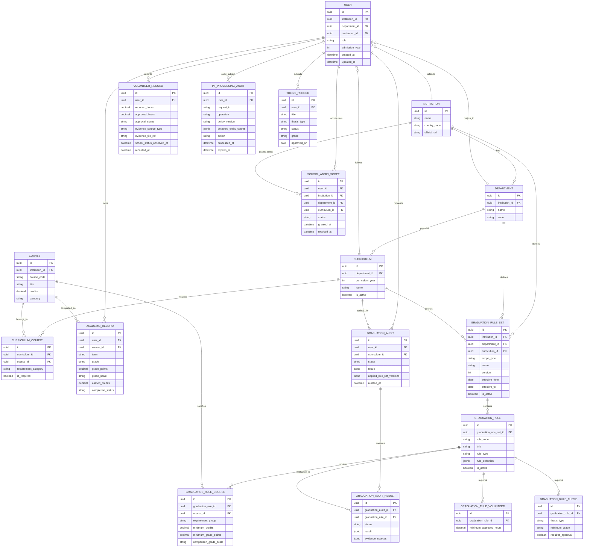
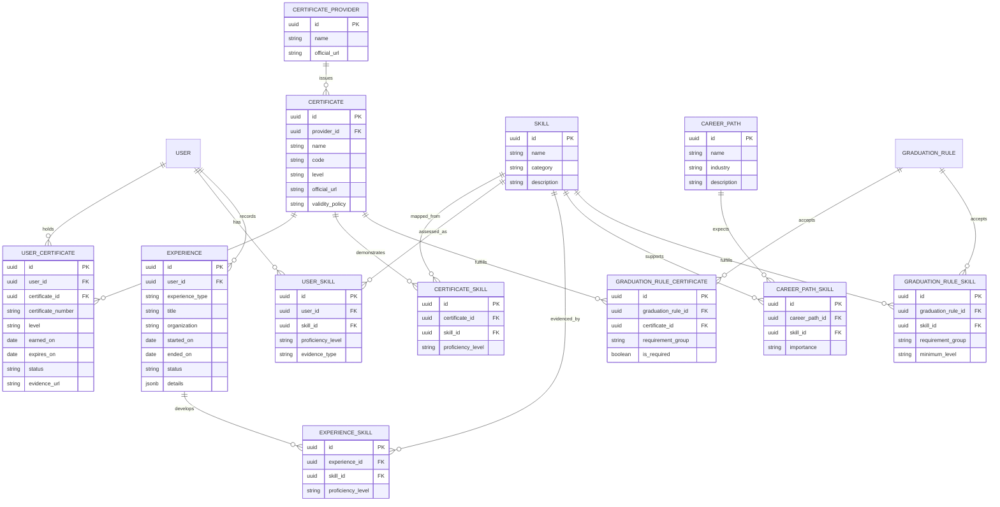
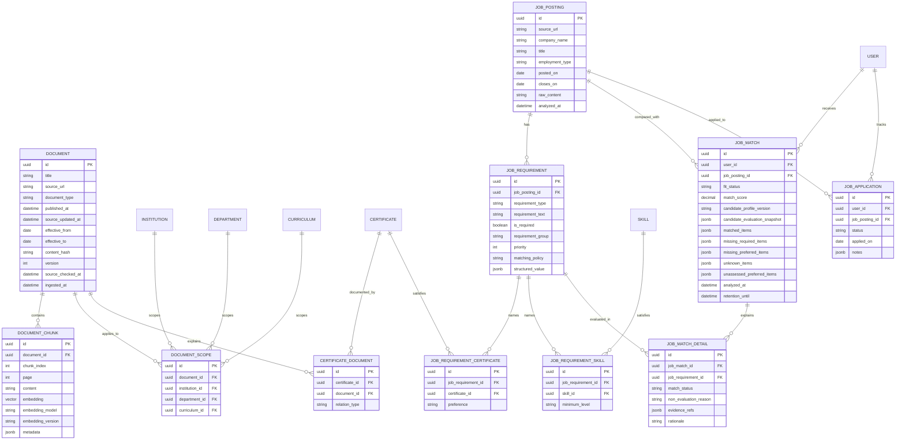

# 확장 데이터베이스 ERD 및 MVP 단계

이 문서는 UniversityPath AI의 **전체 논리 데이터 모델**과 단계별 실제 도입
범위를 정의한다. README에 제시된 대표 핵심 엔터티를 바탕으로, 아래 모델은
자격증·역량·진로·채용·개인화를 확장하기 위한 기준이다.

모든 식별자는 UUID를 사용한다. 실제 DB 모델과 외부 API 스키마는 분리하며,
각 단계에서 필요한 테이블만 Alembic 마이그레이션으로 생성한다.

## 1. 학사 및 사용자 코어

`User.role`은 최소 `user`, `school_admin` enum으로 관리한다. `school_admin`은
`SchoolAdminScope`에서 부여된 학교·학과·교육과정 범위의 공식 데이터만 관리할 수
있다. 사용자의 학교·학과·교육과정 FK는 데이터 미등록 또는 미지원 학교 사용자를
지원하기 위해 nullable로 설계할 수 있으며, 직접 입력한 학사·활동 데이터의 소유권은
학교 데이터와 독립적으로 항상 사용자에게 남는다. 실제 학교 관리자 신원 검증 및
권한 부여 절차는 구현 전에 별도로 확정한다.

`GraduationRuleSet`은 규칙의 적용 계층을 표현한다. 한 사용자의 졸업감사에는
해당 학교의 `institution` 규칙 묶음, 소속 학과의 `department` 규칙 묶음, 적용
교육과정의 `curriculum` 규칙 묶음을 함께 선택해 모두 판정한다. 즉 학교 공통
규정만 충족해도 학과 추가 요건을 통과하지 못하면 최종 결과는 충족이 아니다.

규칙 묶음의 `scope_type`은 `institution`, `department`, `curriculum` enum으로
제한한다. 구현 시에는 범위에 맞는 FK만 지정되도록 제약한다. 즉 학교 규칙은
`institution_id`만, 학과 규칙은 `institution_id`와 `department_id`, 교육과정
규칙은 세 범위 FK를 모두 가진다. 감사에는 사용된 규칙 묶음의 버전을 스냅샷으로
남기며, 이미 실행된 감사에 적용된 규칙 묶음을 변경·재작성하지 않는다.

사용자가 직접 구성한 학교·학과·교육과정 규칙은 공식 `GraduationRuleSet`과 분리된
개인 규칙 세트로 관리한다. 이 세트는 지원하지 않는 학교의 학생이 자신의 직접 입력
기록을 기준으로 개인 기준 계산을 수행할 때만 사용하며, 공식 규칙·공식 문서·다른
사용자에게 반영하지 않는다. 개인 계산 결과는 공식 `GraduationAudit`와 다른 유형 또는
명시적인 `official=false` 구분을 가져야 한다. 학교 관리자가 공식 규정과 적용 범위를
등록하면 공식 `GraduationRuleSet`이 공식 감사에서 우선하며, 개인 규칙이나 사용자의
이수기록을 덮어쓰거나 삭제하지 않는다. 적용 가능한 공식 규칙 묶음이 하나도 없으면
공식 `GraduationAudit.status`는 `not_applicable`으로 기록하고 졸업 가능 여부를
판정하지 않는다.

과목 최소 성적 요건은 원 성적 표기(`grade`)와 계산용 점수(`grade_points`)를
함께 보존하고, `GraduationRuleCourse`의 기준 점수와 `comparison_grade_scale`로
비교한다. 학교별 성적 체계 차이는 Rule Engine의 성적 환산 정책에서 처리한다.

`GraduationRule`은 반드시 Rule Engine이 해석한다. `rule_definition`은 복잡한
계산식을 보조하지만, 과목·자격증·논문·역량처럼 교차 도메인에서 직접 참조하고
검증할 요소는 관계 테이블로도 모델링한다. `GraduationAudit`은 한 번의 통합 감사
실행을, `GraduationAuditResult`는 각 규칙의 세부 판정과 출처를 보존한다.

`VolunteerRecord`는 사용자가 직접 입력하거나 학사정보시스템 화면 캡처를 근거로
등록한 **개인 학사정보**다. `reported_hours`는 사용자가 입력한 시간,
`approved_hours`는 사용자가 학교 시스템에서 승인됨을 확인한 시간이다.
`approval_status`는 `pending`, `approved`, `rejected`, `needs_review` enum으로
관리한다. `evidence_source_type`은 `manual_input`, `screenshot`, `other` enum이며,
`evidence_file_ref`에는 영구 저장소 어댑터가 반환한 참조값만 보관한다. 증빙 파일
원문·OCR 텍스트는 공용 RAG, 로그, 외부 LLM으로 전달하지 않는다.

`GraduationRuleVolunteer.minimum_approved_hours`는 학교·학과·교육과정의 공식 규정에서
등록한다. Rule Engine은 `approval_status=approved`인 `VolunteerRecord.approved_hours`의
합계와 이 값을 비교한다. 승인 시간이 없거나 상태가 불명확하면 미충족으로 단정하지
않고 `needs_review`를 반환한다.

## 2. 자격증·역량·진로 확장

자격증은 `Certificate`를 공통 기준 엔터티로 사용한다. 따라서 사용자 보유 현황,
졸업요건 충족 여부, 채용공고 요건, 공식 RAG 문서를 각각 독립적으로 연결하면서도
동일한 자격증을 참조한다. `requirement_group`은 “A·B·C 중 하나” 같은 대체
요건을 표현하기 위한 그룹 식별자다.

졸업감사에서는 먼저 사용자에게 적용되는 학교·학과·교육과정의 규칙 묶음을
선택한다. 그 규칙 묶음 안의 `GraduationRuleCertificate`만 `UserCertificate`와
`Certificate`를 기준으로 비교한다. 즉 보유 자격증이 독립적으로 졸업을 판정하는
것이 아니라, 학교가 정의한 자격증 조건의 충족 여부를 증명한다.

## 3. RAG 지식 및 채용 분석 확장

채용공고는 기본적으로 URL 또는 원문을 `JobPosting`에 수집한 뒤, 구조화된
`JobRequirement`로 추출·매칭한다. 공고 자체를 RAG 코퍼스로 삼을 필요는 없다.
향후 다수 공고의 의미 기반 탐색이 필요해질 때에만 별도 공고 청크·임베딩을
추가한다.

`JobMatch`는 공고 요건과 요청 시점의 후보자 프로필을 비교한 결과다. 후보자
프로필은 `AcademicRecord`, `UserCertificate`, `Experience`(개인 프로젝트 포함),
2차 MVP의 `UserSkill`을 조합해 서비스 계층에서 생성한다.
`candidate_profile_version`과 `candidate_evaluation_snapshot`에는 전체 프로필 원문이
아니라 매칭 당시의 프로필 버전, 요건별 판정값, 필요한 근거 레코드 식별자만
최소한으로 보존한다. 이후 이력 변경에도 결과의 근거를 재현할 수 있지만, 자격증
번호·프로젝트 원문 등 불필요한 개인정보를 중복 저장하지 않는다.
`retention_until` 이후에는 결과와 스냅샷을 자동 파기한다.

`JobRequirement.is_required`는 필수와 우대 요건을 구분한다. `requirement_group`은
“학위 또는 특정 자격증”처럼 대체 가능한 요건을 하나의 조건으로 묶고, `priority`는
우대 요건의 점수 반영 순서를 나타낸다. `matching_policy`는 `evaluated`,
`manual_review`, `informational_only` enum으로 정의하며, 공고 조건마다 자동 비교,
사용자 확인, 정보 제공 전용 여부를 결정한다. `JobMatch.fit_status`는 다음 enum으로
정의한다.

- `meets_required_requirements`: 모든 필수 요건이 충족됨
- `missing_required_requirements`: 하나 이상의 필수 요건이 부족함
- `insufficient_profile_data`: 필수 요건 판정에 필요한 사용자 정보가 부족함
- `needs_review`: 자동 비교할 수 없는 모호한 조건 또는 증빙 검토가 있음

`JobMatchDetail.match_status`는 각 요건의 `met`, `missing`, `unknown`,
`not_evaluated`, `not_applicable`을 보존한다. `evidence_refs`에는 해당 판정을
뒷받침한 이수기록, 자격증, 경험·프로젝트 등의 식별자를 저장한다.

우대 요건 중 `unknown` 또는 `not_evaluated`인 항목은 이유와 함께
`unassessed_preferred_items`로 반환한다. `non_evaluation_reason`은
`profile_data_missing`, `manual_confirmation_required`, `policy_excluded`,
`extraction_uncertain`처럼 자동 비교하지 않은 이유를 저장한다. 이 목록은 특정
민감 조건을 별도 강조하지 않고, 모든 자동 비교 제외 우대조건을 같은 방식으로
공개한다. 이 결과는 채용 합격을 보장하거나 예측하지 않으며, 공고에 적힌 요건과
현재 프로필의 적합도를 보여 주는 값이다.

`Document`와 `DocumentChunk`는 학사·자격증·진로의 **공식 근거 검색용**이다.
`DocumentScope`와 `CertificateDocument`를 통해 학교·학과·교육과정·자격증의
적용 범위를 보존하며, AI 응답에는 문서 제목, URL, 페이지 및 문서 식별자를
반환한다.

`Document`의 `source_updated_at`, `effective_from`, `effective_to`, `content_hash`,
`version`, `source_checked_at`은 최신성 판단과 재수집을 위한 메타데이터다. 질의
시점에는 단순 발행일이 아니라 적용 기간, 원문 갱신 여부, 공식 출처 여부를 함께
고려해 현재 유효한 문서를 우선한다. 원문 해시 또는 임베딩 모델 버전이 달라지면
관련 청크를 재생성·재색인한다.

## 단계별 실제 도입 범위

| 단계 | 목표 | 실제 생성·구현 대상 |
|---|---|---|
| 1차 MVP | 역할·학교 관리 범위, 계층형 학사 판정, 공식 문서·개인화 RAG, 자격증·봉사·논문·캡스톤 요건 관리 | `User`, `SchoolAdminScope`, `Institution`, `Department`, `Curriculum`, `Course`, `CurriculumCourse`, `AcademicRecord`, `VolunteerRecord`, `GraduationRuleSet`, `GraduationRule`, `GraduationRuleCourse`, `GraduationRuleCertificate`, `GraduationRuleVolunteer`, `GraduationRuleThesis`, `GraduationAudit`, `GraduationAuditResult`, `ThesisRecord`, `CertificateProvider`, `Certificate`, `UserCertificate`, `Document`, `DocumentChunk`, `DocumentScope`, `CertificateDocument`, `Experience` |
| 2차 MVP | 진로 정보 RAG, 채용공고 분석, 역량 요건 및 설명 가능한 매칭 | `JobPosting`, `JobRequirement`, `JobRequirementCertificate`, `JobMatch`, `JobMatchDetail`, `Skill`, `UserSkill`, `CertificateSkill`, `ExperienceSkill`, `CareerPath`, `CareerPathSkill`, `GraduationRuleSkill`, `JobRequirementSkill` 및 사용자 경험·자격증 기반 추천 API |
| 3차 MVP | 취업 준비 과정 관리와 고도화된 추천 | `JobApplication`, 지원 상태·피드백 기반 추천, 필요 시 공고 의미 검색용 별도 청크·임베딩, 추천 이력·사용자 피드백 모델 |

## 공통 구현 규칙

- `status`, `completion_status`, `experience_type`, `rule_type`,
  `document_type`, `requirement_type`, `match_status`는 자유 문자열이 아닌 enum으로
  정의한다. 졸업 감사 상태는 `satisfied`, `not_satisfied`, `needs_review`,
  `not_applicable`을 사용한다.
- 졸업요건의 충족·미충족은 RAG나 LLM이 아니라 결정론적인 Rule Engine이
  `AcademicRecord`, `UserCertificate`, 관련 규칙을 이용해 판정한다.
- RAG는 공식 문서 검색과 출처 제공을 담당한다. 근거가 부족하면
  `insufficient_evidence`를 반환하며 추측하지 않는다.
- 외부 LLM 호출, 개인화 RAG 캐시, 애플리케이션 로그에 자유 텍스트가 전달되기 전에는
  PII 탐지·비식별화 어댑터를 거친다. 이 어댑터는 Presidio 같은 도구로 구현할 수
  있으나 특정 도구에 고정하지 않는다.
- `PiiProcessingAudit`에는 탐지된 유형의 개수, 적용 정책 버전, 처리 동작만 남기며
  원문·탐지 위치·마스킹 전후 개인정보는 저장하지 않는다. 보유기간이 지나면 이 감사
  메타데이터도 파기한다.
- PII 탐지는 보조 통제이며 완전한 탐지를 보장하지 않는다. 실제 도입 전에는 한국어
  이름, 연락처, 학번, 자격증 번호 및 학교별 식별자에 대한 인식기와 오탐·미탐
  테스트를 별도로 검증한다.
- 자격증 번호·증빙 URL 등 민감할 수 있는 정보는 최소 수집하고, 로그에 기록하지
  않는다. 실제 개인정보·비밀값은 테스트 데이터로 사용하지 않는다.
- 사용자 정보가 변하지 않는다는 이유만으로 영구 보관하지 않는다. 원본 학사·자격증·경험
  정보는 서비스 제공에 필요한 기간과 사용자에게 고지한 보유기간 동안만 보관하며,
  탈퇴·삭제 요청 또는 보유기간 만료 시 관련 `JobMatch`·캐시·스냅샷도 함께 파기하거나
  개인을 식별할 수 없도록 처리한다.
- RAG 질의·응답 캐시와 매칭 결과 캐시는 원본 사용자 데이터와 분리한다. 공용 캐시에는
  개인 식별자·자격증 번호·프로젝트 원문을 넣지 않으며, 개인화 결과는 사용자 범위와
  프로필 버전에 묶고 짧은 TTL 또는 `retention_until`을 적용한다.
- 이 문서는 논리 모델이다. 물리 타입, 인덱스, 벡터 차원, nullable 정책 및
  마이그레이션은 각 MVP 구현 시점에 PostgreSQL·pgvector 기준으로 확정한다.
